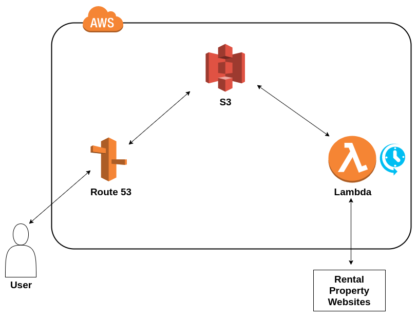

# About cheapdublinrent.guru

This site began as a hobby project while I was studying for Amazon Web Services' Associate Solutions Architect certificate.
Its primary goal was as  a proof-of-concept site, demonstrating a simple static-site architecture which accomodated for its data to be updated throughout the day, in turn availing of the instant-scalability and <a href="https://aws.amazon.com/lambda/pricing/">extremely low cost of AWS Lambda</a> and <a href="https://aws.amazon.com/getting-started/projects/host-static-website/services-costs/">S3 static-site-hosting</a>.
  
Since then I have <a href="http://oisinbates.com/AWSSolutionsArchitectAssociate.pdf"> received my certification</a> and, due to a handful of external factors, I have decided not to move ahead with rental-property web-scraping as a long-term project.
  
I have since transitioned to a new project which I believe to be more suistanable in the long-term and less likely to attract objections.
This new project is a jazz-eduction resource, written in javascript, <a href="http://charlieparkerlicks.com/">charlieparkerlicks.com</a>
 
A selection of other previous hobby projects using AWS, Python, Bash, Java, and Javascript is hosted at <a href="http://oisinbates.com">oisinbates.com</a>.
 

<h2>Architecture</h2>
  <ol>
    <li>Data is scraped using an AWS Lambda function and the python library <a href="https://www.crummy.com/software/BeautifulSoup/bs4/doc/">BeautifulSoup</a>.
    </li>
    <li>The same Lambda function then updates a .json file which holds relevant data for each property listing. Each key in the .json file has a 'price' value which can be referenced when updating the file. This .json file is stored in an AWS S3 bucket and accessed using the Python interface <a href="https://boto3.readthedocs.io/en/latest/">Boto</a>
    </li>
    <li>This lambda function can be scheduled to run on at set times using a <a href="http://docs.aws.amazon.com/lambda/latest/dg/with-scheduled-events.html">cron expression</a></li>
    <li>On the Front End, a Bootstrap website - hosted via AWS <i>Route 53</i> and <i>S3</i> - uses jQuery to pull from the .json file and populate the site with the contents of this .json file</li>
  </ol>
 

 
